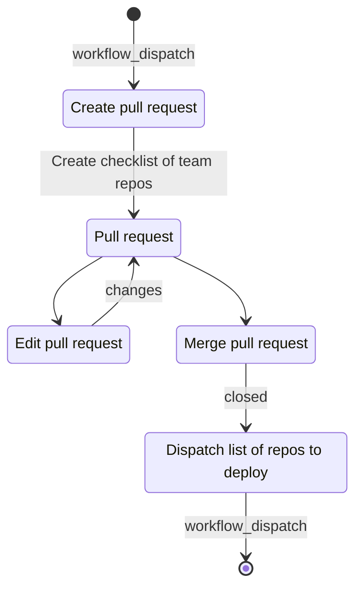

# deployer

[](https://conventionalcommits.org)
[](https://github.com/semantic-release/semantic-release)

<p align="center">
  
  <p align="center">Deploy from a pull request</p>
  <br />
</p>

## Create a deployment

1. Dispatch workflow `deployer-pull-request.yml`

   ```bash
   gh workflow run deployer-pull-request.yml
   ```

2. Goto **"Pull requests"** tab in GitHub and wait until pull request is created
3. Open pull request `chore(ci): repo deployment` and select which repositories to deploy
4. Wait until list of repositories is created
5. Click `Squash and merge`
6. Wait for all selected repositories to be deployed, label with date deployed is added to closed pull request

   **Example**

   

## Pull request flow


